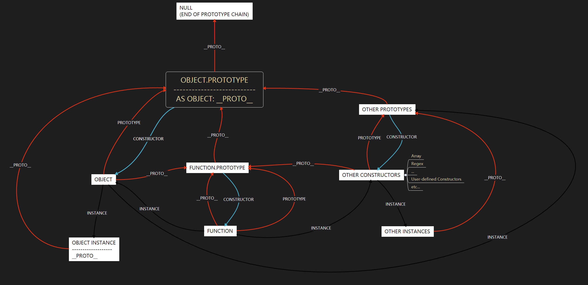

- [原型链的前提规则](#原型链的前提规则)
- [原型链关系试验](#原型链关系试验)
- [试验的一点解释](#试验的一点解释)
- [原型链关系图](#原型链关系图)

---

### 原型链的前提规则

1. 任何对象都拥有`__proto__`属性，指向其 `构造函数 (constructor function)` 的 `原型 (prototype)` 对象

   - 例： 假设有数组对象 a，因为它是由数组构造函数`Array`创建的，那么`a.__proto__`将指向`Array.prototype`

这里可以引申出 2 个推论：

> **推论 1.1**：因为`构造函数 (constructor function)`是函数，而函数都是对象，所以构造函数也是对象。它也有`__proto__`属性，`__proto__`指向构造函数之构造函数的`原型 (prototype)` 对象；

> **推论 1.2**：`原型 (prototype)` 对象也是对象，所以也有`__proto__`属性，并指向 Object 构造函数原型`Object.prototype`；

**疑问 1.1**：`Object.prototype`是否也是对象？如果是，那么它也应该有`__proto__`属性，这个属性应该指向它自身？如果不是对象，那它是什么？

1. 任何函数都是 `函数 (Function)` 创建的实例，且拥有`prototype`属性，该属性指向函数对应的`原型 (prototype)` 对象

   根据 2 和推论 1.1，可以得到推论：

> **推论 2.1**：构造函数既是对象，又是函数实例，因此它不仅拥有`__proto__`属性，也拥有`prototype`属性

> **推论 2.2**：构造函数的`__proto__`属性指向其上一级构造函数`原型 (prototype)` 对象，即`Function.prototype`, 它的`prototype`属性指向`<constructor>.prototype`

**疑问 2.1**：`Function`作为元构造函数，其自身又是哪个构造函数的实例呢？如果`Function`是自身的实例，那么其`__proto__`属性应该指向`Function.prototype`；如果不是，它的`__proto__`属性会指向哪里？

1. 构造函数的`原型 (prototype)`对象都有一个`构造函数(constructor)`属性，指向其对应的构造函数

   - 例：即 Array.prototype.constructor 将指向 Array

### 原型链关系试验

```javascript
/*** 疑问1.1 ***/
typeof Object.prototype; // 'object'
Object.prototype === null; // false
//解释：Object.prototype是对象，按照基础概念1，它有__proto__属性

Object.prototype.__proto__; // null
//解释：Object.prototype.__proto__指向null，它没有__proto__属性

Object.prototype instanceof Object; // false
//解释：Object.prototype不是Object的实例

/************************************************************/

/*** 疑问2.1***/
typeof Function; // 'function'
Function instanceof Function; // true
Function instanceof Object; // true
//解释：Function是构造函数，它是函数，也是对象，所以既有prototype属性，也有__proto__属性

Function.__proto__ == Function.prototype; // true
//解释：根据推论1.1，Function的构造函数是它自己

typeof Function.prototype; // 'function'
Function.prototype.prototype; // undefined
//解释：Function.prototype是函数，但它没有prototype属性

Function.prototype instanceof Function; // fasle
Function.prototype instanceof Object; // true
Function.prototype.__proto__ == Object.prototype; // true
//解释：Function.prototype是函数，但它不是Function的实例，却是Object的实例

typeof Object; // 'function'
Object instanceof Function; // true
Object.__proto__ == Function.prototype; // true
//解释：Object是构造函数，它是Function的实例
```

这里出现了 2 个矛盾点，集中在`Object.prototype`和`Function.prototype`这 2 个对象：

1. `Object.prototype`是对象，却不是 Object 创建的
2. `Function.prototype`是函数，却不是 Function 创建的，而是由 Object 创建，但 Object 明明是 Function 的实例

如果说按照常理，第一点已经怪异到看不懂，那么第二点则是直接变成了“先有鸡 （Function），还是先有蛋 （Object）”的哲学拷问。

### 试验的一点解释

逻辑上这样自然说不通，那么只能说明一开始的前提规则错了，或者更具体点说，提到的这 2 个对象是超越规则的存在，不受前提规则的约束。查了下标准，果然这两个东西是基于规则创建的，为了兼容旧版本 JS 设定了一些规则，和构造函数其实没什么关系。

**关于 Object.prototype（注意加粗部分）**

> ECMA-262 19.1.3 Properties of the Object Prototype Object
>
> The Object prototype object is the intrinsic object %ObjectPrototype%. **The Object prototype object is an ordinary object**.
>
> **The value of the [[Prototype]] internal slot of the Object prototype object is null** and the initial value of the [[Extensible]] internal slot is true.

**关于 Function.prototype（注意加粗部分）**

> ECMA-262 19.2.3 Properties of the Function Prototype Object
>
> The Function prototype object is the intrinsic object %FunctionPrototype%. The Function prototype object is itself a built-in function object. When invoked, it accepts any arguments and returns undefined. It does not have a [[Construct]] internal method so it is not a constructor.
>
> **NOTE - The Function prototype object is specified to be a function object to ensure compatibility with ECMAScript code that was created prior to the ECMAScript 2015 specification.**
>
> The value of the [[Prototype]] internal slot of the Function prototype object is the intrinsic object %ObjectPrototype% (19.1.3). The initial value of the [[Extensible]] internal slot of the Function prototype object is true.
>
> **The Function prototype object does not have a prototype property.**
>
> The value of the length property of the Function prototype object is 0.
>
> The value of the name property of the Function prototype object is the empty String.

### 原型链关系图

最后附上一张自己理解的图，权当费脑子的证明吧


