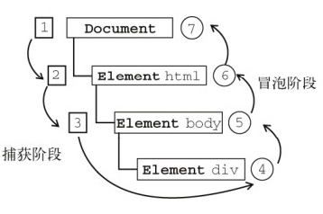

### 背景
使用Vue重构一个jQuery的H5/PC页面，一个列表组件实现滚动加载更多的时候踩了个坑。

### 现象
- 没有触发滚动
开始是把滚动事件绑定在列表组件的父级元素，然后发现无论如何都无法触发滚动事件

- 实现父元素滚动的布局导致了刘海屏下的一个兼容性bug
让html和body的高度都为屏高，父元素继承body高度也撑满body，监听父元素的滚动事件。

这个布局方式导致safe-area区域不能跟随滚动消失，始终占据了屏幕的底部位置

### 原因
先说第一个现象的原因
#### scroll事件冒泡原理
scroll事件和一般的事件不同，没有事件冒泡过程。

也就是在上图的4就结束了，只经过`事件捕获 -> 事件触发`，没有事件冒泡的过程，之前监听父元素的事件委托做法是行不通的。

### 如何正确处理scroll事件

#### 如何判断绑定正确还是错误
#### 绑定document的处理
#### 绑定页面元素的处理

### 其他兼容性处理
#### -webkit-overflow-scrolling: touch

### 总结
1. 