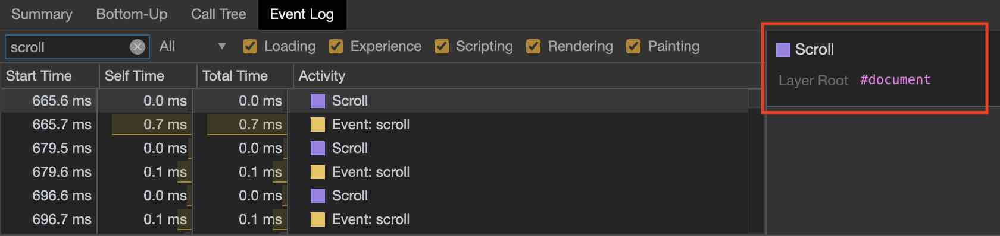

### 背景
使用Vue重构一个jQuery的H5/PC页面，一个列表组件实现滚动加载更多的时候踩了个坑。


### 现象

- 没有触发滚动
开始是把滚动事件绑定在列表组件的父级元素，然后发现无论如何都无法触发滚动事件

- 实现父元素滚动的布局导致了刘海屏下的一个兼容性bug
让html和body的高度都为屏高，父元素继承body高度也撑满body，监听父元素的滚动事件。

这个布局方式导致safe-area区域不能跟随滚动消失，始终占据了屏幕的底部位置


### 原因

先说第一个现象的原因
#### scroll事件冒泡原理
- 一般页面元素的scroll事件和普通事件不同，没有事件冒泡过程

    

    也就是在上图的4就结束了，只经过`事件捕获 -> 事件触发`，没有事件冒泡的过程，之前监听父元素的事件委托做法是行不通的。

- 来自document元素的scroll事件可以冒泡

    由于其自身已经是顶层元素了，所以这个场景下事件冒泡与否已经失去了意义。

- 具体可以参考[这篇文章](https://ayase.moe/2018/11/20/scroll-event/)，写的很清楚


### 如何处理scroll事件

#### 确认监听scroll事件目标元素
首先要明确开发功能的目标是在那个元素监听scroll事件。

比如上面提到safe-area的bug，要让safe-area跟随scroll事件收起和展开，需要监听document元素的滚动事件。

但是其他情况，也许不需要在document元素上监听。比如网页内有个固定高度的table元素，要监听他的内部滚动事件，可以只监听table的scroll事件。

具体监听哪个元素的scroll事件，要根据功能目标来确定。这是思考的出发点。


#### 如何判断绑定正确或错误

在明确监听元素之后，再来观察是否监听到了正确的元素。可以通过以下方法来判断（此处以chrome为例子）：

- `devTool - Performance`，点击`Record`开始录制
- 滚动页面
- 结束录制
- 点击`Event Log`，搜索框内输入scroll，在最右侧就能看到scroll事件绑定的元素
- 确认绑定元素是否为目标元素即可

如下图所示：





#### 绑定document的处理

需要在Vue的生命周期钩子函数中绑定和解绑scroll事件，考虑到H5页面，因此追加了passive属性

```javascript
...
mounted(){
    window.addEventListener('scroll', this.handleScroll, {passive: true});
},
destroyed(){
    window.addEventListener('scroll', this.handleScroll, {passive: true});
}
```


#### 绑定页面元素的处理

可以在目标元素上绑定scroll事件，同时使用passive属性提高移动端滚动体验
```html
<div @scroll.passive="handleScroll">
```

元素对应的CSS中要增加`overflow-y: scroll`或者`overflow-y: auto`的设置

### 其他兼容性处理

#### -webkit-overflow-scrolling: touch
对iOS来说，为了避免滚动卡顿，还需要在滚动的目标元素上设置`-webkit-overflow-scrolling: touch`，开启硬件加速，提升用户体验

Done