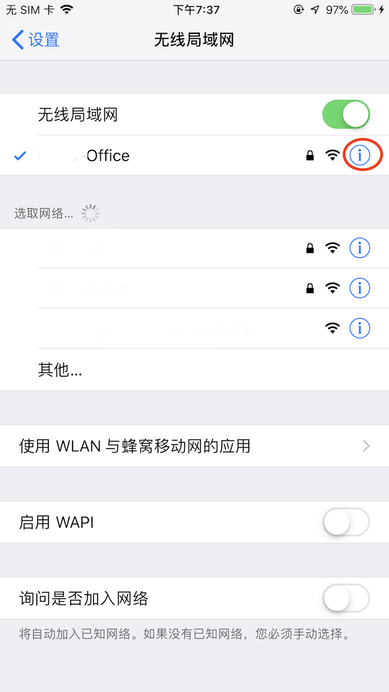
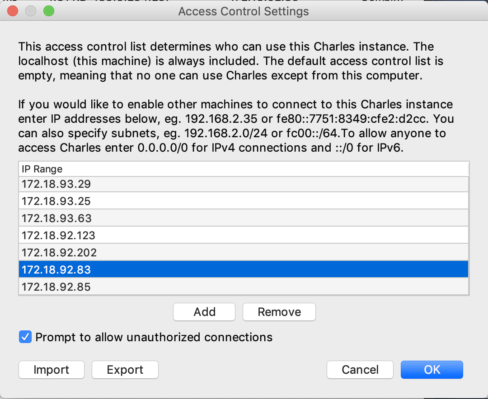

---

title: '使用Charles抓包移动端网络请求'
date: '2019-09-07'
---

### 写在前面

这是4个月前的一篇简要工作记录，重新编辑整理了一下，算是自己技能成长的一个见证。

可以抓包移动端网络请求的工具很多，windows下有fiddler和wireshark，Mac下有Charlse和Surge for Mac（Surge iOS版甚至可以在iOS设备上直接抓包，功能非常强大）。

因为目前使用Mac，所以本文主要介绍如何使用Charles在Mac上进行抓包。

> 注意： **以下全程，请保持电脑和手机在同一个局域网内**

### 抓包普通请求

> 这部分iOS和Android方法类似，以iOS为例说明

1. 打开Charles代理设置窗口，点击  Proxy -> Proxy Settings

   

   

2. 设置代理端口号，勾选 Enable transparent HTTP proxying，并设置一个端口号，比如8888

   

   

3. 手机端配置

   - 打开 设置-> 无线局域网，点击已连接wif的蓝色图标，图中红圈处

   
  
   

   - HTTP代理选手动配置

   

   

   

   - 服务器配置为电脑的IP，端口设为之前charles配置的端口

   

   

4. 允许手机连接charles

   这个时候随便访问一个网页，charles就会提示，选择“允许”

   

   

   如果不小心关掉了也没关系，打开Proxy -> Access Control Settings，添加手机的IP就可以了

   

   

之后手机上的任何http请求，都可以被charles抓包查看了，Done.

### 抓包https请求

上面的配置只能抓包http请求，但是现在主要网站大都是https的，请求数据会显示为乱码，不可读。需要额外配置让charles可以抓包https的请求。根据官网的说明，抓包https请求需要在手机上安装charles证书。

为什么需要安装证书呢？官方的说明如下：

> [SSL Proxying](https://www.charlesproxy.com/documentation/proxying/ssl-proxying/)
>
> Charles does this by becoming a man-in-the-middle. Instead of your browser seeing the server’s certificate, Charles dynamically generates a certificate for the server and signs it with its own root certificate (the Charles CA Certificate). Charles receives the server’s certificate, while your browser receives Charles’s certificate. Therefore you will see a security warning, indicating that the root authority is not trusted. If you add the Charles CA Certificate to your trusted certificates you will no longer see any warnings – see below for how to do this.
>
> Charles still communicates via SSL to the web server. The communication is SSL (encrypted) from web browser to Charles and also SSL (encrypted) from Charles to the web server.
>
> 

这个抓包本质上是一种中间人攻击 (Man in the Middle Attack)。

只不过单纯抓包并没有篡改数据，只是charles作为代理和服务端通信，然后转发数据和charles动态生成的证书给手机。如果不安装证书，手机浏览器会提示证书不可信，以存在安全风险为由，拒绝接受charles发回的数据。

理论上，charles当然也可以篡改数据后再发给手机，似乎某些更高级的功能就是基于此实现的。这不是本文的主题了，以后有机会再写。

废话结束，下面继续说明如何安装证书。

#### 安装证书

##### Charles启用SSL代理功能

- 启动SSL代理

  

- 配置要代理的网站域名和端口，以下以V2EX为例，访问接口 https://www.v2ex.com/api/nodes/show.json?name=jobs

  

- 打开需要手机访问安装证书的网站

  

- 根据弹窗提示找到网址

  

##### 手机端配置

> 证书安装在iOS和Android两端不同，手机端的配置分为两部分写

##### iOS

- 手机Safari打开`https://chls.pro/ssl`这个网址下载证书

  

- 根据提示下载证书，返回设置，在已下载描述文件中找到该证书

  

- 安装证书

  

- 关于本机开启信任证书

  

- happy抓包

  

  

- 如果不开启信任证书

  

  

  

##### Android

- 前三步和iOS相同，手机Chrome打开网址下载证书并安装

- 安装成功之后各个安卓手机有所不同了，我用的坚果pro2

  坚果pro2： 设置 - 解锁与安全 - 高级设置 - 受信任的凭据 - 用户tab

  

  

  

- 如果安装失败，可以下载证书文件到本地，选择从存储设备安装（可以参考[这篇](https://cosmeapp.github.io/2017/09/26/install-charles-certificate-android/)）

  - 坚果pro2:    设置 - 解锁与安全 - 高级设置 - 从存储设备安装，见上图

- happy抓包

  

- 如果没有安装证书

  

  
#### 记录完毕，收工
