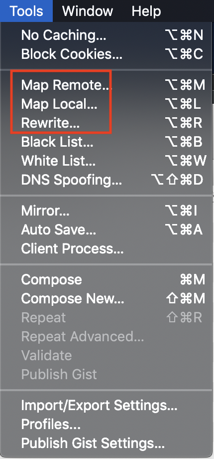

### 写在前面

这是4个月前的一篇工作记录，是上一篇Charles使用的扩展版。

因为平时用Mac，所以只列出了Mac调试不同移动端的情况，windows没有涉及。

在Mac下调试App常用3种手段：

1. USB调试
2. 使用腾讯开源的vConsole
3. 使用Charles调试

### USB调试

#### iOS USB调试

功能强大，可以修改网页元素，但有限制挺多的：

1. 只能在Mac系统调试移动端，windows的开发环境就不行了
2. 要么调试浏览器打开的网页，要么是Xcode编译运行中的App内页，非编译版的App内页无法调试

如果以上条件满足的话，那么可以按以下步骤开启调试：

1. USB连接手机，手机弹出的对话框选择信任当前电脑
2. 在Mac上打开Safari，找到 `Develop(或“开发”)->your iphone（即用户给手机取的名字）`，就能看到当前可调试的网页，任选一个打开就能在Safari中调试当前网页

可以直接修改/插入DOM元素，也可以改样式，和直接调试网页一摸一样，所见即得，简直可以说是为所欲为

#### Android USB调试

Android调试也有一些限制条件：

1. Android版本在4.4以上，手机要打开USB调试模式，电脑端必须使用chrome浏览器
2. 要么调试手机端浏览器打开的网页，要么调试开启了webview调试模式的App内页（WebView.setWebContentsDebuggingEnabled设为true，也就是测试版的App）

可以按以下步骤开启调试：

1. 手机切换为开发者模式（不同手机开启方式差异太大，不细说了）
2. 按照此链接内容完成后续配置：[google官方文档: remote debugging](https://developers.google.com/web/tools/chrome-devtools/remote-debugging/)

之后就可以打开浏览器愉快的调试了，happy debugging~

#### 小结

| 平台    | 要求                                                         | 适用情景                                                     | 是否需要修改代码 |
| ------- | ------------------------------------------------------------ | ------------------------------------------------------------ | ---------------- |
| iOS     | 只能在MacOS桌面端调试                                        | Safari网页 Xcode编译运行的App内页，不可用于真机App内页   | 否               |
| Android | Android 4.4以上 手机打开USB调试模式 使用Chrome浏览器调试 | Chrome网页 测试版App内页（WebView.setWebContentsDebuggingEnabled设为true） | 否               |

#### 

### vConsole调试

vConsole是腾讯开源调试工具，使用需要修改代码，有一定的侵入性。但是这个代价换来了所有平台的调试能力，在上面2种USB调试条件不满足的情况下，还是很值得使用的。

事实上，因为大多数情况并不需要USB调试那种修改DOM的能力，目前我在需要调试App内页的时候，用的最多的就是vConsole。查看内嵌页的console输出和api接口返回都很省事，而且通过后端渲染也能控制只在测试环境使用vConsole，对线上环境没有任何影响。

多数情况下，我觉得它是首要的调试手段。

#### 小结

| 平台    | 要求 | 适用情景                   | 是否需要修改代码 |
| ------- | ---- | -------------------------- | ---------------- |
| iOS     | 无   | 各种浏览器网页 App内页 | 是               |
| Android | 无   | 各种浏览器网页 App内页 | 是               |

### 

### Charles调试

前一篇谈到了：[使用Charles抓包移动端网络请求](https://javahashbrown.github.io/Blog/使用Charles抓包移动端网络请求/)

接口请求、文件下载请求都可以通过抓包查看，但Charles能做的还不止于此。

打开Charles->Tools，如下图，红框中的3个工具算是Charles的高级功能了

#### Map Local - 映射到本地文件

可以配置代理，将特定链接的访问指向本地文件（夹），将本地文件转发回移动端

使用场景： 

1. mock接口返回数据：把按照协议规定的数据保存为json文件，在请求接口地址时，返回这个json文件，就可以当作接口的数据返回
2. 替换文件，查看模拟展示效果：比如某个页面开发完成但还没有发布，又想看线上的数据展示效果，就可以把对那个页面的请求重定向会本地修改完毕的文件，这样就可以实现用线上数据加载未发布的文件的效果

#### Rewrite - 改写接口返回数据

配置代理，可以针对特定的接口修改其返回数据，可以修改返回数据本身、cookie、请求头等等

使用场景：mock接口

#### Map Remote - 映射到远程代理

其实就是重定向，通过配置代理，将对指定URL的请求重定向到配置的另一个远程地址

使用场景：这个功能没用过，感觉如果用起来和map local的第二种场景差不多

#### 小结

| 调试功能         | 使用场景                               |
| ---------------- | -------------------------------------- |
| 映射到本地文件   | mock接口 替换文件，查看模拟展示效果 |
| 改写接口返回数据 | mock接口                               |
| 映射到远程代理   | 替换文件，查看模拟展示效果             |

